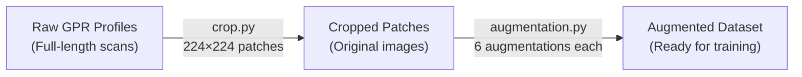

# Advanced Buried Object Detection — Full Project Analysis

## 1. Project Overview

This project is a **GPR (Ground Penetrating Radar)** buried object detection system. GPR sends electromagnetic waves underground and records reflections. When it hits a buried object (pipe, cable, cavity), the signal bounces back in a characteristic **hyperbolic pattern** (inverted "U" shape) in the B-scan image. The goal: **detect these hyperbolas automatically using deep learning**.

---

## 2. The Dataset Pipeline

The dataset pipeline is a 3-step process:



### Step 1: Cropping ([crop.py](file:///d:/Advanced-Buried-Object-Detection/crop.py))
The raw GPR profiles are **very wide** horizontal scans. [crop.py](file:///d:/Advanced-Buried-Object-Detection/crop.py) slices them into **224×224 px patches** — a size compatible with pretrained backbones like VGG19.

### Step 2: Augmentation ([augmentation.py](file:///d:/Advanced-Buried-Object-Detection/augmentation.py)) → Applied to `GPR_Data/Utilities` folder, outputs to `GPR_Data/Utilities/augmented_images`

### Step 3: Annotation — Done externally using [makesense.ai](https://www.makesense.ai/), exported in both YOLO `.txt` and VOC XML formats.

---

## 3. Why Data Augmentation? (Critical for this project)

> [!IMPORTANT]
> The original dataset is **very small**: only 79 cavity profiles, 131 utility profiles, and 75 intact profiles (285 total originals). Deep learning models need **thousands** of training examples to generalize.

### The 5 Core Reasons Augmentation is Necessary

| Reason | Explanation |
|--------|-------------|
| **Small Dataset** | 285 original images is far too few. Augmentation expands it to **2,239 images** (~8× increase). |
| **Prevent Overfitting** | A model trained on only 285 images will memorize them. Augmented variants force the model to learn **general features** (hyperbola shapes) instead of pixel-specific patterns. |
| **Real-World Variability** | GPR data varies hugely with soil type, moisture, antenna frequency, scan speed, and operator technique. Augmentations simulate this variability. |
| **Class Imbalance** | Utilities (131) has nearly 2× the images of cavities (79). Augmentation can help balance representation. |
| **Robustness** | The model must detect hyperbolas under noise, at different positions, at different scales — exactly what the augmentations simulate. |

---

## 4. The 6 Augmentation Techniques — Explained

Each original image produces **6 augmented versions** (`_aug_1` through `_aug_6`):

### Aug 1: Gaussian Noise (`add_noise`, std=0.15)
```
Purpose: Simulates electromagnetic interference, sensor noise, and varying soil conditions
GPR rationale: Real GPR data is inherently noisy. The model must detect hyperbolas through clutter.
```

### Aug 2: Time Shift (`time_shift`, shift=20px horizontally)
```
Purpose: Shifts the image 20 pixels to the right (with wrap-around)
GPR rationale: Simulates different starting positions of the survey wheel.
         The hyperbola should be detected regardless of its horizontal position.
```

### Aug 3: Rotation (`rotate_image`, angle=15°)
```
Purpose: Rotates the image 15° with border reflection
GPR rationale: Simulates slightly tilted scans or angled subsurface interfaces.
         Hyperbolas may appear slightly skewed in real data.
```

### Aug 4: Horizontal Flip (`flip_image`, mode=1)
```
Purpose: Mirrors the image left-to-right
GPR rationale: A hyperbola should be detected regardless of scan direction.
         This doubles the effective variety of hyperbola positions.
```

### Aug 5: Elastic Deformation (`elastic_transform`, alpha=34, sigma=4)
```
Purpose: Applies random smooth distortions to the image
GPR rationale: Simulates varying soil densities, heterogeneous subsurface layers,
         and different material properties that warp hyperbola shapes.
```

### Aug 6: Spectral Shift (`spectral_shift`, shift=100)
```
Purpose: Shifts the image in the frequency domain (FFT)
GPR rationale: Simulates different antenna frequencies and material permittivity effects.
         GPR data is fundamentally frequency-dependent, so this is domain-specific.
```

> [!NOTE]
> The spectral shift augmentation is **unique to GPR** — most standard augmentation pipelines don't include it. It's particularly relevant because GPR data is acquired with different antenna frequencies (400 MHz / 200 MHz in this dataset).

---

## 5. Full Dataset Breakdown

### Original Data (Pre-augmentation)

| Folder | Images | Description |
|--------|--------|-------------|
| `cavities/` | 79 | Original GPR profiles with underground voids |
| `Utilities/` | 131 | Original GPR profiles with buried pipes/cables |
| `intact/` | 75 | Original GPR profiles with no anomalies |
| **Total** | **285** | |

### Augmented Data (Post-augmentation)

| Folder | Images | Annotations | Notes |
|--------|--------|-------------|-------|
| `augmented_cavities/` | 553 | ✅ YOLO + VOC XML (553 each) | 79 × 7 ≈ 553 |
| `augmented_utilities/` | 786 | ✅ YOLO + VOC XML (786 each) | 131 × 6 = 786 |
| `augmented_intact/` | 900 | ❌ None (no objects to detect) | 75 × 12 = 900 |
| **Total** | **2,239** | | |

### YOLO Annotation Format
```
<class_id> <x_center> <y_center> <width> <height>
```
- All values are **normalized** (0.0 to 1.0) relative to image dimensions
- Both cavities and utilities use **class 0** currently (single-class detection)
- Example: `0 0.665009 0.913379 0.284734 0.173242` → Object centered at 66.5% right, 91.3% down, spanning 28.5% width and 17.3% height

> [!WARNING]
> **Both cavities and utilities are labeled as class 0** in the existing annotations. For multi-class YOLO detection, you'd need to relabel cavities as class 1 (see training section below).

---

## 6. How to Train a YOLO Model (Step-by-Step)

### Option A: Treat as **Single-Class** (Hyperbola Detection)

If your goal is simply "detect any hyperbola" (whether utility or cavity), you can use the existing annotations as-is since both use class 0.

### Option B: **Multi-Class** Detection (Utility vs Cavity)

Requires relabeling cavity annotations to class 1.

---

### Step-by-Step Training Guide (Using YOLOv8)

#### 1. Install Ultralytics
```bash
pip install ultralytics
```

#### 2. Organize Dataset into YOLO Directory Structure

YOLO expects this exact structure:

```
dataset/
├── images/
│   ├── train/      # ~80% of images
│   └── val/        # ~20% of images
├── labels/
│   ├── train/      # matching .txt files
│   └── val/        # matching .txt files
└── data.yaml       # dataset config
```

Here's a script to prepare it:

```python
import os
import shutil
import random

random.seed(42)

# === CONFIG ===
BASE = "GPR_data"
OUTPUT = "yolo_dataset"
SPLIT_RATIO = 0.8  # 80% train, 20% val

# Source directories
sources = {
    "utilities": {
        "images": f"{BASE}/augmented_utilities",
        "labels": f"{BASE}/augmented_utilities/annotations/YOLO_format",
        "class_remap": None  # Keep class 0
    },
    "cavities": {
        "images": f"{BASE}/augmented_cavities",
        "labels": f"{BASE}/augmented_cavities/annotations/Yolo_format",
        "class_remap": None  # Keep class 0 (single-class)
        # For multi-class, set to: {0: 1}  (remap 0→1 for cavities)
    }
}

# Create output directories
for split in ["train", "val"]:
    os.makedirs(f"{OUTPUT}/images/{split}", exist_ok=True)
    os.makedirs(f"{OUTPUT}/labels/{split}", exist_ok=True)

for category, paths in sources.items():
    img_dir = paths["images"]
    lbl_dir = paths["labels"]
    remap = paths["class_remap"]

    # Get all image files
    images = [f for f in os.listdir(img_dir) if f.lower().endswith(('.jpg', '.jpeg', '.png'))]
    random.shuffle(images)

    split_idx = int(len(images) * SPLIT_RATIO)
    splits = {"train": images[:split_idx], "val": images[split_idx:]}

    for split, img_list in splits.items():
        for img_file in img_list:
            # Copy image
            src_img = os.path.join(img_dir, img_file)
            dst_img = os.path.join(OUTPUT, "images", split, f"{category}_{img_file}")
            shutil.copy2(src_img, dst_img)

            # Copy/remap label
            label_file = os.path.splitext(img_file)[0] + ".txt"
            src_lbl = os.path.join(lbl_dir, label_file)
            dst_lbl = os.path.join(OUTPUT, "labels", split, f"{category}_{label_file}")

            if os.path.exists(src_lbl):
                if remap:
                    with open(src_lbl, 'r') as f:
                        lines = f.readlines()
                    with open(dst_lbl, 'w') as f:
                        for line in lines:
                            parts = line.strip().split()
                            cls = int(parts[0])
                            if cls in remap:
                                parts[0] = str(remap[cls])
                            f.write(" ".join(parts) + "\n")
                else:
                    shutil.copy2(src_lbl, dst_lbl)

print("Dataset prepared!")
```

#### 3. Create `data.yaml`

For **single-class** detection:
```yaml
# data.yaml
path: ./yolo_dataset
train: images/train
val: images/val

nc: 1  # number of classes
names: ['hyperbola']  # or 'buried_object'
```

For **multi-class** detection:
```yaml
# data.yaml
path: ./yolo_dataset
train: images/train
val: images/val

nc: 2
names: ['utility', 'cavity']
```

#### 4. Train the Model

```bash
# YOLOv8 nano (fastest, good for testing)
yolo detect train data=data.yaml model=yolov8n.pt epochs=100 imgsz=224 batch=16

# YOLOv8 small (better accuracy)
yolo detect train data=data.yaml model=yolov8s.pt epochs=150 imgsz=224 batch=16

# YOLOv8 medium (best accuracy, needs more VRAM)
yolo detect train data=data.yaml model=yolov8m.pt epochs=200 imgsz=224 batch=8
```

**Key parameters:**
| Parameter | Recommended Value | Why |
|-----------|------------------|-----|
| `imgsz` | **224** | Dataset images are 224×224 |
| `epochs` | 100–200 | Small dataset needs more epochs |
| `batch` | 8–16 | Depends on GPU VRAM |
| `patience` | 50 | Early stopping if no improvement |
| `lr0` | 0.01 | Default learning rate |
| `augment` | True (default) | YOLO has built-in augmentations too |

#### 5. Evaluate & Predict

```bash
# Validate on val set
yolo detect val model=runs/detect/train/weights/best.pt data=data.yaml

# Run inference on new images
yolo detect predict model=runs/detect/train/weights/best.pt source=path/to/new/images

# Export to ONNX for deployment
yolo export model=runs/detect/train/weights/best.pt format=onnx
```

#### 6. Python API (Alternative)

```python
from ultralytics import YOLO

# Load pretrained YOLOv8
model = YOLO('yolov8s.pt')

# Train
results = model.train(
    data='data.yaml',
    epochs=150,
    imgsz=224,
    batch=16,
    name='gpr_detector',
    patience=50
)

# Validate
metrics = model.val()
print(f"mAP50: {metrics.box.map50:.3f}")
print(f"mAP50-95: {metrics.box.map:.3f}")

# Predict
results = model.predict('path/to/gpr_image.jpg', conf=0.25)
```

---

## 7. Summary & Recommendations

> [!TIP]
> **Recommended approach:** Start with **single-class YOLOv8s** (small) at 224×224, train for 150 epochs. This balances speed and accuracy for your dataset size.

| Aspect | Recommendation |
|--------|---------------|
| **Model** | YOLOv8s (small) — best balance for ~1,300 annotated images |
| **Input size** | 224×224 (matches your data) |
| **Classes** | Start with 1 class ("hyperbola"), add cavity/utility distinction later |
| **Training split** | 80/20 train/val (no test set needed for this dataset size) |
| **Key metric** | mAP50 — standard for object detection |
| **GPU** | Any modern GPU with 4GB+ VRAM is sufficient |
